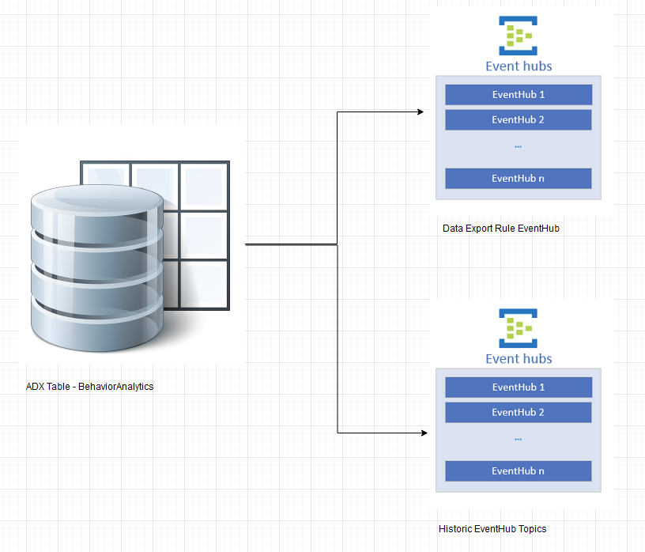

## HistoricDataExport
Historic Data Export to move logs from Azure Log Analytics Workspace to Azure Data Explorer(ADX) via EventHub

## Prerequisites
1. Azure Data Explorer (ADX) Cluster with active "Data Export" rules

## Automation Features  

## **Part #1 - Create-Historic-Table-Raw-Mappings-DataExport.ps1**  
1. Installs all the required modules
	```
	Az.Resources
	Az.OperationalInsights
	Kusto.CLI
	```
2. Once user is authorized, it provides two options  
	a.	To Export all the tables from thhe given Log Analytics workspace  
	b.	Enter the selected Log Analytics Table Names (Case-Sensitive) by comma separated
	
3. Script verifies whether tables from Log Analytics or User Input is supported by “Data Export” feature, for all the un-supported tables it will skip  and continue with the next steps. To see all the supported tables navigate to [here](https://docs.microsoft.com/en-us/azure/azure-monitor/logs/logs-data-export?tabs=portal#supported-tables)

4. Script will perform the following steps in ADX  
	A. **Create raw tables** The raw data is ingested first to an intermediate table where the raw data is stored. At that time, the data will be manipulated and expanded. Using an update policy (think of this as a function that will be applied to all new data), the expanded data will then be ingested into the final table that will have the same schema as the original one in Log Analytics/Sentinel. We will set the retention on the raw table to 0 days, because we want the data to be stored only in the properly formatted table and deleted in the raw data table as soon as it’s transformed. Detailed steps for this step can be found [here](https://docs.microsoft.com/en-us/azure/data-explorer/ingest-data-no-code?tabs=diagnostic-metrics#create-the-target-tables).  
	
	B. **Create table mapping** Because the data format is json, data mapping is required. This defines how records will land in the raw events table as they come from Event Hub. Details for this step can be found [here](https://docs.microsoft.com/en-us/azure/data-explorer/ingest-data-no-code?tabs=diagnostic-metrics#create-table-mappings).  
	
	C. **Create update policy** and attach it to raw records table. In this step we create a function (update policy) and we attach it to the destination table so the data is transformed at ingestion time. See details [here](https://docs.microsoft.com/en-us/azure/data-explorer/ingest-data-no-code?tabs=diagnostic-metrics#create-the-update-policy-for-metric-and-log-data). This step is only needed if you want to have the tables with the same schema and format as in Log Analytics  
	
	D.  **Modify retention for raw table** The default retention policy is 100 years, which might be too much in most cases. With the following command we will modify the retention policy to be 1 year:    
	```.alter-merge table <tableName> policy retention softdelete = 365d recoverability = disabled  ```  
	
5. Create EventHub Namespaces. In this step, script will create EventHub Namespaces by dividing the total number of tables by 10  
	Note: Event Hub Standard tier has limitation of having 10 EventHub Topics  
	
6. Create Data Export Rule. In this step, script will create Data Export rules for each EventHub Namespace with 10 Tables each  

	Note:
	a.	Based on the output from Step #4, script will create “Data Export” rules for each 10 Tables  
	b.	LA supports 10 Data Export rules targeting 10 different EventHub Namespaces i.e., you can export 100 tables using 10 Data Export rules  
	
7. Create data connection between EventHub and raw data table in ADX. In this step, script will iterate all the EventHub Namespaces and retrieve EventHub Topics and creates ADX Data connection rules specifying the target raw table, mapping table and EventHub Topic  

8. Creates detailed log file to verify - if there is any error  

9. By Executing this script(Create-Historic-Table-Raw-Mappings-DataExport.ps1) - it creats additional data source to the existing ADX Table  



## **Part #2 - Migrate-Historic-Logs-ADX.ps1 – Execution depends on size of the Workspace**
1. This script will accept Start Date and End Date  
	a.Start Date  
		First record TimeStamp in UTC
	b.End Date  
		Date you created “Data Export” rule  
2. Script will recursively query the Log Analytics within the time range and the results will be pushed to EventHub Topic  

As soon as the data is available in “EventHubTopic” – it gets ingested to ADX Main table  
